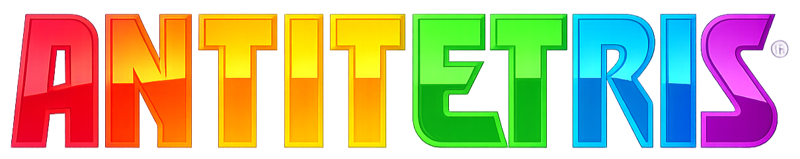

Антитетрис — это перевернутый тетрис, где фигуры не падают под твоим управлением. Ты выбираешь, какой геометрический мусор достанется компьютеру, а дальше программа алгоритмически подбирает для фигуры наиболее выгодную постановку в стакан.

`promo.mp4`: [посмотреть промо](./promo.mp4)

## Вот зе фак из гоин он

Вместо классической задачи "собери линии сам" игра предлагает другой конфликт: человек принимает стратегическое решение, а программа вынуждена раскладывать выбранные фигуры по заданным правилам оценки поля. Из-за этого каждый ход превращается не в проверку реакции, а в проверку понимания формы, пустот, рельефа поля и слабых мест алгоритма.

В проекте есть два режима:

- `Versus` — соревновательный режим. Игрок подсовывает компьютеру самые неудобные фигуры, чтобы тот быстрее забил поле и проиграл.
- `Coop` — кооперативный режим. Игрок, наоборот, старается предлагать программе простые и удобные фигуры, чтобы команда прожила как можно дольше и набрала больше очков.

## Правила и игровая логика

### Базовые правила

- Поле имеет размер `7 x 16`.
- На каждом ходе игрок видит `4` фигуры на выбор.
- На выбор дается `4` секунды.
- После выбора программа перебирает возможные варианты и находит лучшую позицию и лучший поворот для этой фигуры.
- Если подходящей позиции нет, раунд заканчивается.

### Режим `Versus`

- Стартовый счет: `100` очков.
- Цель игрока: обнулить возможности компьютера раньше, чем закончатся очки.
- Если таймер выбора истекает, набор фигур просто обновляется, а игрок теряет `5` очков.
- Если компьютер собирает полную линию, игрок теряет еще `5` очков за каждую линию.
- Если счет падает до `0`, побеждает компьютер.
- Если поле переполнено, а очки еще остались, побеждает игрок.

Практически это означает, что выгодно создавать:

- неровный рельеф;
- глубокие колодцы;
- внутренние пустоты;
- выступы и разрывы, которые сложно закрыть следующими фигурами.

### Режим `Coop`

- Стартовый счет: `0`.
- Цель игрока: помогать алгоритму выживать как можно дольше.
- За поставленную фигуру команда получает очки, равные размеру фигуры.
- За каждую очищенную линию команда получает еще `15` очков.
- Если таймер истекает, компьютеру принудительно выдается случайная фигура из текущего набора.
- По текущей реализации кода за такой пропуск снимается `25` очков.
- Раунд заканчивается, когда на поле больше нельзя поставить очередную фигуру.

Дополнительно в `Coop` расширяется сложность набора фигур:

- базово доступны фигуры размером от `4` до `5` клеток;
- каждые `500` очков повышают уровень;
- с ростом уровня увеличивается максимальный размер фигур в наборе.

## Откуда берутся фигуры

Игра не хранит заранее зашитый список фигур. Вместо этого она генерирует все связные полимино нужного размера:

- сначала строятся все возможные формы из `N` клеток;
- затем одинаковые фигуры удаляются через каноническую нормализацию;
- для каждой фигуры сохраняются все уникальные повороты;
- перед показом игроку из текущего пула случайно выбираются `4` разные фигуры.

Это делает набор партий менее предсказуемым: игра опирается не только на тетромино, а на более широкий класс фигур.

## Как работает выбор хода

После выбора фигуры программа перебирает:

- все уникальные повороты фигуры;
- все допустимые позиции по горизонтали;
- итоговую высоту падения для каждой позиции.

Для каждого кандидата симулируется постановка, затем оценивается качество поля. Алгоритм старается максимизировать итоговый score позиции и штрафует проблемные структуры.

Основные метрики оценки:

- число дыр;
- глубина дыр;
- суммарная высота колонок;
- максимальная высота;
- перепады высот между колонками;
- переходы заполнено/пусто по строкам и столбцам;
- глубина колодцев;
- опасность верхних строк;
- бонус за очищенные линии.

Поверх локальной оценки есть и короткий lookahead:

- из текущего пула случайно берется до `10` фигур;
- для каждой оценивается лучший следующий ход;
- алгоритм добавляет поправку на худший из этих сценариев.

За счет этого алгоритм старается не только пережить текущий ход, но и не загнать поле в тупик через одну-две фигуры.

Важно: в проекте не используется искусственный интеллект, машинное обучение или внешняя модель. Все решения принимаются детерминированным алгоритмом перебора позиций, оценки состояния поля и короткого lookahead по следующим фигурам.

## Техническая часть

### Архитектура

Проект полностью собран в одном файле: [`index.html`](/Users/konstantinkuzin/DEV/antitetris/index.html).

Внутри него находятся:

- HTML-разметка интерфейса;
- CSS-оформление обоих режимов;
- вся игровая логика на чистом JavaScript;
- Web Audio-эффекты для выбора, падения и очистки линий.

Сборщик, фреймворк и внешние зависимости не используются.

### Основной цикл хода

1. Игра показывает игроку `4` фигуры.
2. Запускается таймер выбора.
3. Игрок выбирает фигуру или дожидается истечения времени.
4. Компьютер ищет лучшую постановку.
5. Проигрывается анимация падения.
6. Фигура фиксируется на поле.
7. При необходимости очищаются линии и обновляется счет.
8. Генерируется новый набор фигур.

### Структура состояния

В рантайме игра хранит:

- `board` — текущее поле;
- `offered` — текущий набор фигур на выбор;
- `nextPiece` — фигура, переданная компьютеру;
- `turn` — число завершенных ходов;
- `score` — текущий счет;
- `clearedLines` — сколько линий было очищено;
- `mode` — активный режим;
- `busy`, `choicesFrozen`, `gameOver` — флаги этапа игры;
- `unlockedSizeLevel` — прогресс расширения набора фигур в `Coop`.

### Как запустить

Достаточно открыть `index.html` в браузере. Отдельный сервер не обязателен, потому что проект не зависит от API и не подгружает внешние ресурсы.
